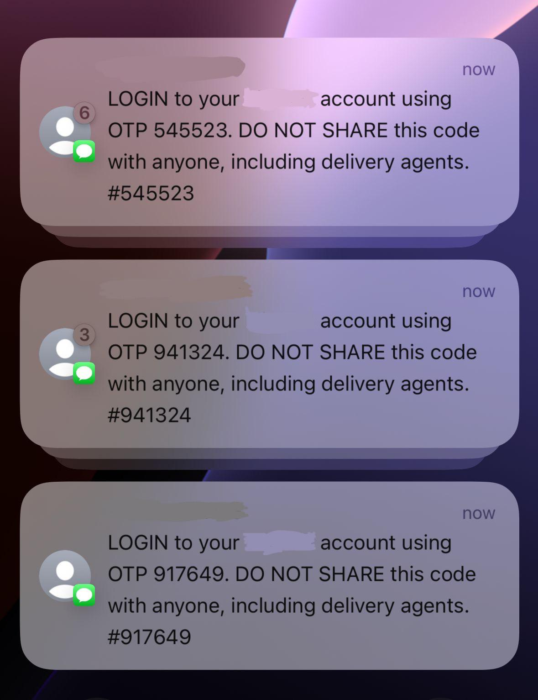

# SMS Bomber

A cross-platform tool for sending multiple SMS verification requests to a target phone number.


## 📱 Example



*Screenshot showing SMS Bomber sending verification requests to a target number*

## ⚠️ Disclaimer

This tool is provided for **EDUCATIONAL PURPOSES ONLY**. SMS bombing can be considered harassment and may be illegal in many jurisdictions. The authors and contributors are not responsible for any misuse of this software.

- **DO NOT** use this on phone numbers without explicit permission
- **DO NOT** use this tool to harass, annoy, or harm others
- **DO NOT** use this tool for any malicious purposes

## 📋 Features

- Send SMS verification requests in configurable batches
- Cross-platform compatibility (Windows, macOS, Linux)
- Multi-threaded for improved performance
- Batch processing with cooldown periods to avoid rate limiting
- Automatic browser fingerprint randomization
- Detailed progress tracking and statistics

## 🔧 Requirements

- Python 3.6 or higher
- Chrome browser installed
- Internet connection
- For Python 3.12+: setuptools package (included in requirements.txt)

## 📦 Installation

1. Clone the repository or download the source code:

```bash
git clone https://github.com/abhinavkale-dev/Sms-Bomber.git
cd sms_bomber
```

2. Create and activate a virtual environment:

**Windows:**
```bash
python -m venv venv
venv\Scripts\activate
```

**macOS/Linux:**
```bash
python3 -m venv venv
source venv/bin/activate
```

3. Install the required dependencies:

```bash
pip install -r requirements.txt
```

## ⚙️ Configuration

Open `sms_bomber.py` in a text editor and modify these variables at the top of the file:

```python
# Configure these variables
PHONE_NUMBER = "1234567890"  # <-- Put the target phone number here
BATCH_SIZE = 50              # <-- Number of SMS to send per batch
NUMBER_OF_BATCHES = 3        # <-- Number of batches to send
MAX_CONCURRENT_BROWSERS = 5  # <-- Number of parallel browsers per batch
BATCH_COOLDOWN = (120, 180)  # <-- Cooldown between batches in seconds (min, max)
```

## 🚀 Usage

Run the script using Python:

```bash
python sms_bomber.py
```

The program will:
1. Start multiple browser instances in parallel
2. Send SMS verification requests to the target number
3. Take a cooldown break between batches
4. Display detailed progress and statistics

## 📊 Monitoring

The script provides real-time feedback:
- Current batch and attempt progress
- Success/failure for each attempt
- Countdown timer between batches
- Summary statistics after completion

## 🔄 How It Works

1. The script opens multiple Chrome browser instances
2. Each browser navigates to Flipkart's login page
3. It enters the target phone number in the login field
4. It clicks the "Request OTP" button to send a verification SMS
5. After completing a batch, it takes a cooldown period
6. It repeats this process for the configured number of batches

## 🛠️ Troubleshooting

- **Browser crashes**: Try reducing `MAX_CONCURRENT_BROWSERS`
- **Low success rate**: Try increasing `BATCH_COOLDOWN` values
- **Element not found errors**: The website may have changed; update the selectors
- **Rate limiting**: Try reducing batch size or increasing cooldown period
- **Missing distutils module error**: This occurs on Python 3.12+ because distutils was removed from the standard library. Install setuptools: `pip install setuptools` or simply run `pip install -r requirements.txt`

## 📝 License

This project is licensed under the MIT License - see the LICENSE file for details.

## 🤝 Contributing

Contributions are welcome! Please feel free to submit a Pull Request.

## 📞 Contact

If you have any questions or feedback, please open an issue on GitHub.

---

Remember: Use responsibly and ethically. Only use on phone numbers you own or have explicit permission to test. 